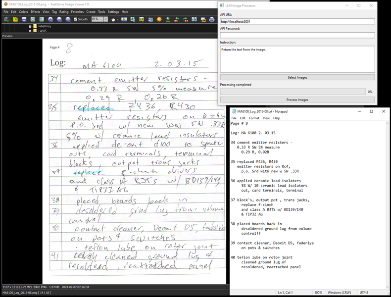

# LLMOCR

[](https://opensource.org/licenses/MIT)

LLMOCR uses a local LLM to read text from images.

You can also change the instruction to have the LLM use the image in the way that you prompt.



## Features
 
- **Local Processing**: All processing is done locally on your machine.
- **User-Friendly GUI**: Includes a GUI. Relies on Koboldcpp, a single executable, for all AI functionality.  
- **GPU Acceleration**: Will use Apple Metal, Nvidia CUDA, or AMD (Vulkan) hardware if available to greatly speed inference.
- **Cross-Platform**: Supports Windows, macOS ARM, and Linux.


## Installation

### Prerequisites

- Python 3.8 or higher
- KoboldCPP

### Windows Installation

1. Clone the repository or download the [ZIP file](https://github.com/jabberjabberjabber/LLavaImageTagger/archive/refs/heads/main.zip) and extract it.

2. Install [Python for Windows](https://www.python.org/downloads/windows/).

3. Download [KoboldCPP.exe](https://github.com/LostRuins/koboldcpp/releases) and place it in the LLMOCR folder. If it is not named KoboldCPP.exe, rename it to KoboldCPP.exe 

4. Run `llm_ocr.bat` It will create a python environment and download the model weights. The download is quite large (6GB) and there is no progress bar, but it only needs to do this once. Once it is done KoboldCPP will start and one of the terminal windows will say ```Please connect to custom endpoint at http://localhost:5001``` and then it is ready.


### Mac and Linux Installation

1. Clone the repository or download and extract the ZIP file.

2. Install Python 3.8 or higher if not already installed.

3. Create a new python env and install the requirements.txt.

4. Run kobold with flag --config llm-ocr.kcppt
   
5. Wait until the model weights finish downloading and the terminal window says ```Please connect to custom endpoint at http://localhost:5001```

6. Run llm-ocr-gui.py using Python.


## License

This project is licensed under the MIT License - see the [LICENSE](LICENSE) file for details.

## Acknowledgements

- [KoboldCPP](https://github.com/LostRuins/koboldcpp) for local AI processing
- [PyQt6](https://www.riverbankcomputing.com/software/pyqt/) for the GUI framework
